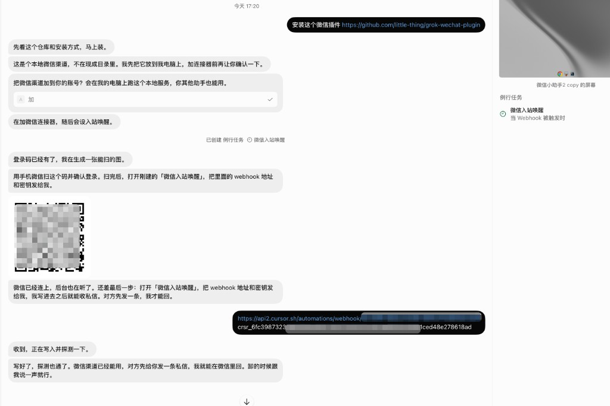
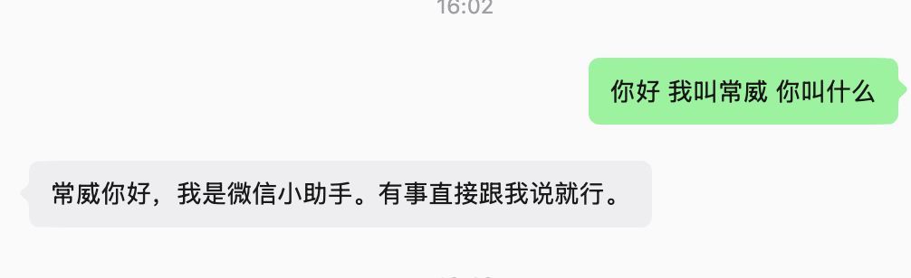

# grok-wechat-plugin

[中文](README.md) | [English](README.en.md)

Grok Bot 的微信 iLink 渠道。入站消息经 webhook 唤醒 agent。

## 一句话安装

在 Grok Bot 里发：

```
安装这个微信插件 https://github.com/little-thing/grok-wechat-plugin
```

## 绑定流程

按对话一步走完即可，整段过程如下：



1. **确认添加渠道**  
   对话里会出现「加」按钮，点一下，把微信渠道接到 Grok Bot。

2. **连接器与专属助手**  
   助手会加上微信连接器（所有助手共用）。每次扫码绑定成功后，为该微信用户创建**专属助手**，在其下建 Routine **「微信入站唤醒」**（Webhook），并用 `wechat_set_wake` 绑定该号的 webhook。另建一条共用 Routine **「微信监听保活」**（每 5 分钟调用 `wechat_start_monitor`）。

3. **扫码登录微信**  
   对话里会出一张二维码，用手机微信扫码确认绑定。需要绑定更多微信账号时，再次取码扫码，为每个号各建专属助手并 `wechat_set_wake`。

4. **配置 webhook**  
   在专属助手的 Routine「微信入站唤醒」里复制 **webhook 地址** 和 **密钥**，调用 `wechat_set_wake`（传入该号的 `ilink_bot_id`）。探测通过后，该号的私信只唤醒该专属助手。

对方给你发一条微信私信，就能在微信里收到回复。

## 绑定后的效果

在微信里直接说话即可，例如：



## 多账号

一个连接器可绑定多个微信个人号。每人独立扫码、各配专属助手与 webhook（`wechat_set_wake`）；A 号私信只唤醒 A 的助手，B 不受影响。`wechat_status` 查看全部账号及 `has_wake`。

## 链路

微信私信 → monitor 收件箱 → POST 该号专属 webhook → 专属助手醒来 → `wechat_send`

任务做完立刻 `wechat_send`。

`bot_agent` 为 `Grokbot/1.0.0`。

安装细节见 `skills/wechat-channel/SKILL.md`。

## 卸载

跟 Grok Bot 说「卸掉微信插件」。助手会：

1. 调用 `wechat_uninstall`（或执行 `scripts/uninstall.sh`）清理本机：停止 monitor、删除 `/home/box/grok-wechat-plugin` 与 `/home/box/.grok-wechat`（含账号 token、wake、自启脚本）。
2. 从 Settings 卸载 `grok-wechat` 连接器（若尚未卸载）。仅从 Settings 卸载时，插件也会在 MCP 退出与 monitor 超时后自动清理本机残留。
3. 删除**所有助手**上的 Routine「微信入站唤醒」和「微信监听保活」，并通知其他仍保留这些 Routine 的助手（如测试1、微信小助手）一并删除。
4. 清理扫码绑定时创建的专属助手上的微信 Routine。

完成后重装需重新扫码，`wechat_status` 为零账号。
